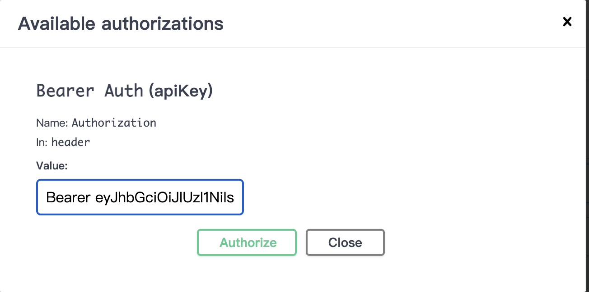
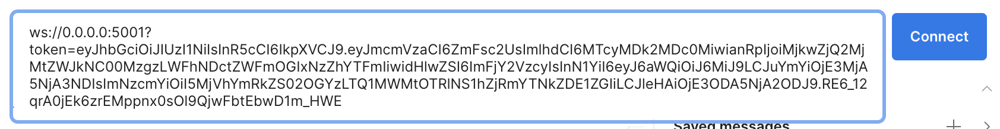

# CSE Space Allocation Management System
## Team: F18AIkun

### Introduction
The Computer Science and Engineering (CSE) Space Allocation Management System is a space allocation system which allows HDR students and CSE staff to book a meeting room or hot desk.

### Technology Stack
- **Frontend:** React
- **Backend:** Python Flask RESTful API
- **Database:** PostgreSQL

### Installation Guide
#### Run Together
Run the following command in the project root directory:
docker-compose up --build
#### Run Separate
**Frontend:**
cd frontend
docker build -t frontend .
docker run -d -p 3000:3000 frontend
**Backend:**
cd backend
docker-compose up --build 
#### URLs
- **Frontend URL:** http://localhost:3000
- **Backend URL and Swagger Document URL:** http://localhost:5001

### Backend
#### Swagger API Document Guide
Access the Swagger API documentation through http://localhost:5001.
You can use the authorize feature to add a token, please prepend "Bearer " before the token.

#### Socket IO Related Function Testing Guide
We use Postman for testing Socket.IO related functions.

For Socket.IO related functions, we need three accounts to connect:
- One user account as the user
- One admin account for the admin
- One admin account for the monitor (We send chat history when connected, but Postman can't receive messages when connected, so we need a monitor to listen to the history).

The monitor needs to listen to messages such as `admin_chat_history`, `user_chat_history`, and `request_notification`.
The monitor needs to join the user's and admin's room by typing `{"room": "z1"}`. The user and admin need to listen to messages. The user uses `send_message` to send a message `{"msg": "hello"}`, and the admin uses `reply_message` to reply with `{"msg": "good", "user_id": "z5405325"}`. When the user sends a request, the monitor will receive a notification.